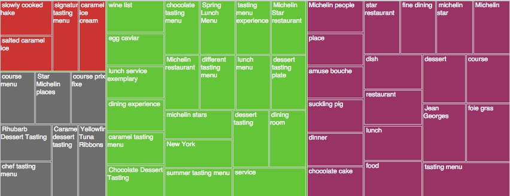

# Fletcher MVP

## Project Description

To this day, Michelin Guides award one, two, and three star sets to the restaurants with the best menu and wine list. Losing and gaining stars can have a major impact on business (French chef Bernard Loiseau killed himself in 2003 when he was certain his restaurant would lose its three-star status). Some cities are more blessed with Michelin stars than others.

After Paris and Tokyo, New York City has the most Michelin stars. There are 6 Three Star restaurants, 9 Two Star restaurants, and 60 One Star restaurants. The price of a meal for two can range anywhere from $50 - $300. Adding in wine, pushes many people into the four figures.

If I was going to spend that much money, I would want some foresight into what items on the menu to purchase.

## Data Exploration

I scraped Yelp's website to get the 2000 most reviews for Jean-Georges.

  Jean Georges is a three-Michelin-stars restaurant at 1 Central Park West (between West 60th Street and West 61st Street), on the lobby level of the Trump International Hotel and Tower, on the Upper West Side of Manhattan, New York City, named after its owner Jean-Georges Vongerichten.

  According to Michelin star rating, it is one of the top five best French restaurant in the Americas (US, Canada, and Latin America). It also remains one of the few restaurants in the city awarded four stars by The New York Times. The current executive chef is Mark LaPico.

## Sentiment Analysis

Sentiment analysis (also known as opinion mining) refers to the use of [natural language processing](https://en.wikipedia.org/wiki/Natural_language_processing), [text analysis](https://en.wikipedia.org/wiki/Text_mining) and [computational linguistics](https://en.wikipedia.org/wiki/Computational_linguistics) to identify and extract subjective information in source materials.

Generally speaking, sentiment analysis aims to determine the attitude of a speaker or a writer with respect to some topic or the overall contextual polarity of a document. The attitude may be his or her judgment or evaluation (see [appraisal theory](https://en.wikipedia.org/wiki/Appraisal_theory)), affective state (that is to say, the emotional state of the author when writing), or the intended emotional communication (that is to say, the emotional effect the author wishes to have on the reader).

In the case of restaurant reviews, I focused on the intended emotional communication. I wanted to see if the reviewer expressed Positive, Negative, Mixed or Neutral sentiment towards certain menu items.

## Visualization of Sentiment

First iteration of sentiment used Alchemy's Sentiment API.

## Additional Observations and Future Work
1. Need to extract out only food / menu based keywords
* Getting a scattered bag of keywords

2. Iterations of Sentiment Analysis
* Use TextBlob or NLTK
* Use Google Prediction, Alchemy

3. Create a function to automate the scraping of Yelp and expand to other restaurants in NYC and other cities in US

## Sources

- Wikipedia
- Yelp
